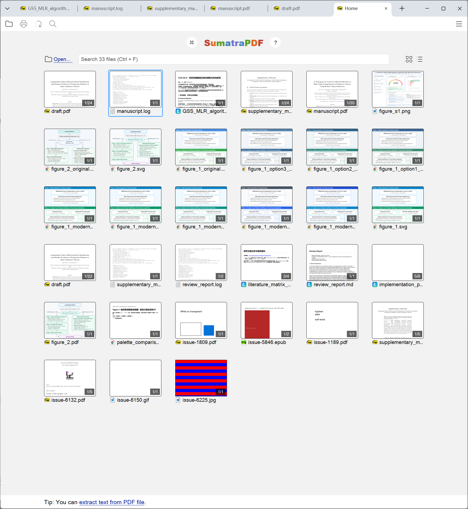

  

<h1 align="center">SumatraPDF Reader</h1>

<strong>Fast, lightweight, and customizable multi-format document reader.</strong>

SumatraPDF 是一个面向 Windows 的多格式（PDF、EPUB、MOBI、CBZ、CBR、FB2、CHM、XPS、DjVu）极速阅读器，具备极低的系统资源占用、极简的界面设计与增强的 Markdown 与 LaTeX 排版渲染支持。

  

## 核心特性

- **多格式支持**：PDF、EPUB、MOBI、CBZ、CBR、FB2、CHM、XPS、DjVu 全能阅读
- **极速启动与低内存占用**：原生 C++ 构建，启动秒开，内存消耗极小
- **增强 Markdown 渲染**：居中排版优化，原生支持 LaTeX 行内与块级数学公式
- **标签页设计与现代化界面**：柔和边框阴影，圆角菜单设计与舒适的深/浅色模式
- **快捷键盘交互**：快速查找、目录跳转与平滑缩放体验

## 更多信息

- [官方网站](https://www.sumatrapdfreader.org/free-pdf-reader)
- [使用手册](https://www.sumatrapdfreader.org/manual)
- [开发者文档](https://www.sumatrapdfreader.org/docs/Contribute-to-SumatraPDF)

## 开源许可

本项目基于 (A)GPLv3 许可开源，部分代码采用 BSD 许可（详见 AUTHORS）。
