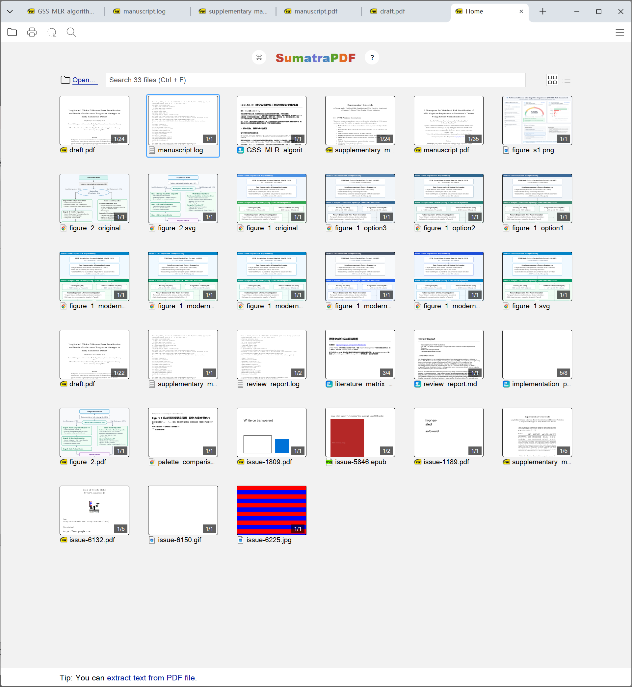

  

<h1 align="center">SumatraX</h1>

<strong>A lightweight Windows document reader with a focused UI and Markdown math.</strong>

  
  
  
  

  <a href="https://github.com/yuzhounh/SumatraX/releases/latest">下载发布版</a> · <a href="#快速开始">快速开始</a> · <a href="COPYING">开源协议</a>

SumatraX 是基于 SumatraPDF 深度定制的专注、极简型多格式文档阅读器。在保持极速启动与超低资源占用的同时，强化了窗口布局记忆、极简界面交互以及增强的 Markdown 与 LaTeX 数学公式渲染体验。

  

## 功能特点

- **固定与记忆窗口位置**：精准记忆上次关闭时的窗口尺寸与屏幕位置，新窗口原位保持打开，杜绝多窗口错位层叠困扰
- **极简专注界面（Minimal Viewer）**：精简重组工具栏控件，右上角汉堡菜单，隐去冗余视觉干扰
- **现代化标签页设计**：支持原生 `+` 新建标签按钮、Chrome 风格标签快速搜索下拉列表与柔和圆角视觉
- **多格式支持**：PDF、EPUB、MOBI、CBZ、CBR、FB2、CHM、XPS、DjVu 全能解析
- **增强 Markdown 渲染**：居中排版优化，原生支持 LaTeX 行内与块级数学公式排版
- **单文件独立便携**：完全独立命名与隔离配置（`SumatraX-settings.txt`），可与官方 SumatraPDF 并行使用互不干扰

## 快速开始

在 [发布页](https://github.com/yuzhounh/SumatraX/releases/latest) 下载 Windows x64 安装版（`.exe`）或便携版（`.zip`）。便携版解压后即可运行；两种版本都可与官方 SumatraPDF 并行使用。

打开 PDF、EPUB、MOBI 或 Markdown 文件即可阅读；Markdown 数学公式的显示方式见下方功能说明。

## 更多信息

- [官方网站](https://www.sumatrapdfreader.org/free-pdf-reader)
- [使用手册](https://www.sumatrapdfreader.org/manual)
- [开发者文档](https://www.sumatrapdfreader.org/docs/Contribute-to-SumatraPDF)

## 开源协议

本项目基于 (A)GPLv3 许可开源，部分代码采用 BSD 许可（详见 AUTHORS）。
